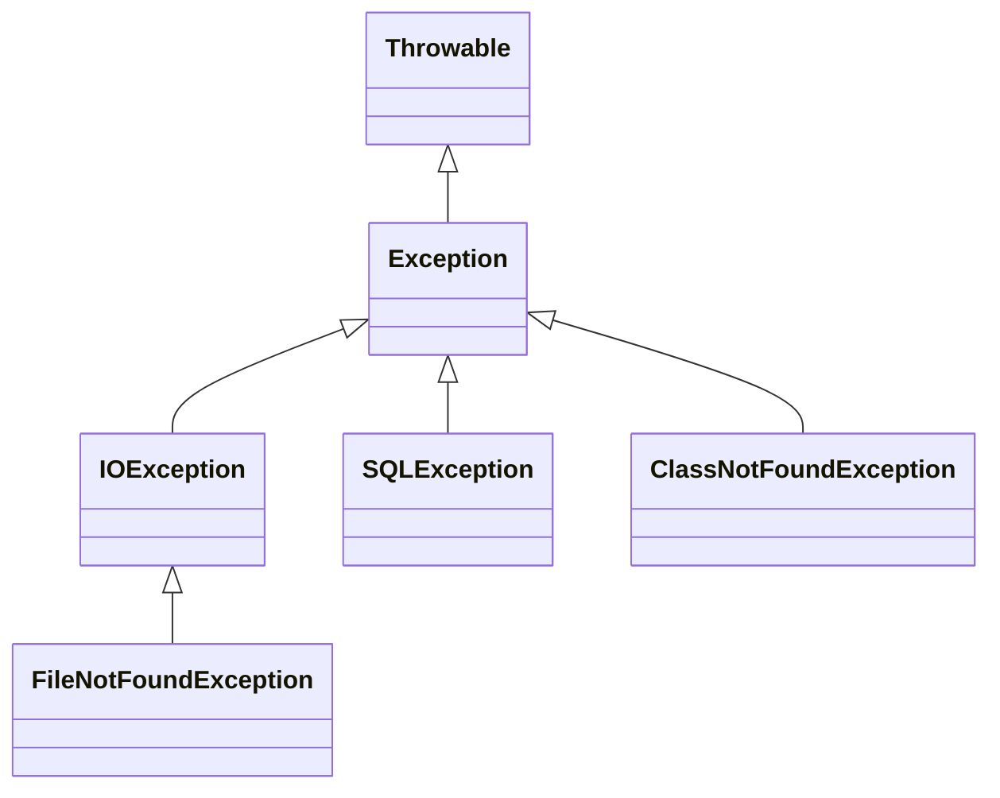

# Checked Exceptions in Java

## Introduction
**Checked Exceptions** in Java are exceptions that are checked at **compile-time**. 
This means that the Java compiler requires the programmer to handle these exceptions either by using a `try-catch` block or by declaring them in the method signature using the `throws` keyword.

If these exceptions are not properly handled, the program will not compile.

---

## Key Points
- Checked at **compile-time**.
- Must be **handled** using `try-catch` or declared using `throws`.
- Typically caused by **external factors** beyond the control of the programmer (e.g., file handling, database connectivity, network errors).
- Part of the `Exception` class hierarchy (excluding `RuntimeException`).

---

## Examples of Checked Exceptions
- `IOException`
- `SQLException`
- `ClassNotFoundException`
- `FileNotFoundException`
- `InterruptedException`

---

## Exception Hierarchy Focus (Checked Exceptions)

```plaintext
                Throwable
                   |
               Exception
                   |
        -------------------------
        |                       |
Checked Exceptions        Unchecked Exceptions
(IOException,             (RuntimeException, etc.)
 SQLException)
```

### Diagram Representation


---

## Example 1: File Handling (IOException)

```java
import java.io.*;

class CheckedExample {
    public static void main(String[] args) {
        try {
            FileReader file = new FileReader("test.txt"); // may throw FileNotFoundException
            BufferedReader reader = new BufferedReader(file);
            System.out.println(reader.readLine());
            reader.close();
        } catch (IOException e) {
            System.out.println("Error: " + e.getMessage());
        }
    }
}
```

---

## Example 2: Using `throws` with Checked Exceptions

```java
import java.io.*;

class ThrowsExample {
    static void readFile() throws IOException {
        FileReader fr = new FileReader("test.txt");
        BufferedReader br = new BufferedReader(fr);
        System.out.println(br.readLine());
        br.close();
    }

    public static void main(String[] args) {
        try {
            readFile();
        } catch (IOException e) {
            System.out.println("Handled IOException: " + e.getMessage());
        }
    }
}
```

---

## Difference between Checked and Unchecked Exceptions

| Feature                  | Checked Exceptions                      | Unchecked Exceptions |
|---------------------------|-----------------------------------------|----------------------|
| **Checked at**           | Compile-time                            | Runtime              |
| **Handling Required**    | Yes, must handle                        | No, optional         |
| **Examples**             | IOException, SQLException, ClassNotFoundException | NullPointerException, ArithmeticException |

---

## Advantages of Checked Exceptions
- Forces developers to handle potential issues in advance.
- Makes programs more **robust and reliable**.
- Provides better error reporting and debugging support.

---

## Conclusion
Checked exceptions in Java are designed to ensure that critical operations such as file handling, database access, and network communication are managed safely. By enforcing compile-time checks, they help developers anticipate and properly handle possible error scenarios, making applications more **stable and maintainable**.