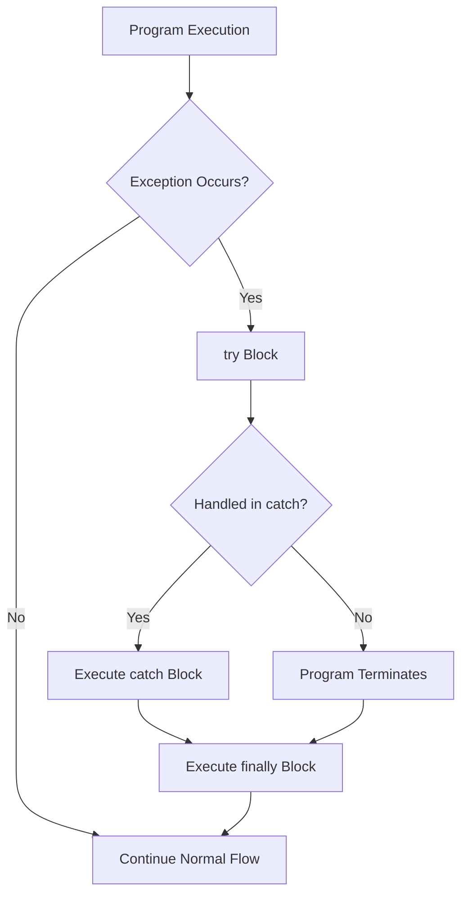

# 📘 Exception Handling in Java

Exception handling in Java is a mechanism to handle runtime errors, ensuring the normal flow of the program.  

Java provides **5 keywords** for exception handling:
- `try`
- `catch`
- `finally`
- `throw`
- `throws`

---

## 🔹 1. try-catch-finally

### ✅ Syntax
```java
try {
    // code that may throw exception
} catch(ExceptionType e) {
    // code to handle exception
} finally {
    // block of code that always executes
}
```

- **try** → contains risky code that may cause exception.  
- **catch** → handles the exception.  
- **finally** → always executes (used for closing resources, cleanup).  

### ✅ Example
```java
public class TryCatchFinallyDemo {
    public static void main(String[] args) {
        try {
            int result = 10 / 0; // risky code
        } catch (ArithmeticException e) {
            System.out.println("Exception caught: " + e);
        } finally {
            System.out.println("Finally block always executes!");
        }
    }
}
```

**Output:**
```
Exception caught: java.lang.ArithmeticException: / by zero
Finally block always executes!
```

---

## 🔹 2. throw

- The `throw` keyword is used to **explicitly throw an exception**.  
- It is used inside a method or block.  

### ✅ Example
```java
public class ThrowDemo {
    static void checkAge(int age) {
        if (age < 18) {
            throw new ArithmeticException("Not eligible to vote");
        } else {
            System.out.println("Eligible to vote");
        }
    }

    public static void main(String[] args) {
        checkAge(15);
    }
}
```

**Output:**
```
Exception in thread "main" java.lang.ArithmeticException: Not eligible to vote
```

---

## 🔹 3. throws

- The `throws` keyword is used in the **method declaration**.  
- It specifies which exceptions a method can throw to the caller.  

### ✅ Example
```java
import java.io.*;

public class ThrowsDemo {
    // Method declaring checked exception
    static void readFile() throws IOException {
        FileReader file = new FileReader("test.txt");
        BufferedReader br = new BufferedReader(file);
        System.out.println(br.readLine());
    }

    public static void main(String[] args) {
        try {
            readFile();  // method call
        } catch (IOException e) {
            System.out.println("Exception handled: " + e);
        }
    }
}
```

**Output:**
```
Exception handled: java.io.FileNotFoundException: test.txt (No such file or directory)
```

---

## 🔹 Exception Handling Flow Diagram



---

## 📌 Summary

| Keyword   | Description |
|-----------|-------------|
| `try`     | Defines block of code that might throw exception |
| `catch`   | Handles exception |
| `finally` | Executes always (cleanup code) |
| `throw`   | Used to explicitly throw exception |
| `throws`  | Declares exceptions a method can throw |

---

✅ With this, you can handle both **checked** and **unchecked exceptions** effectively.  
