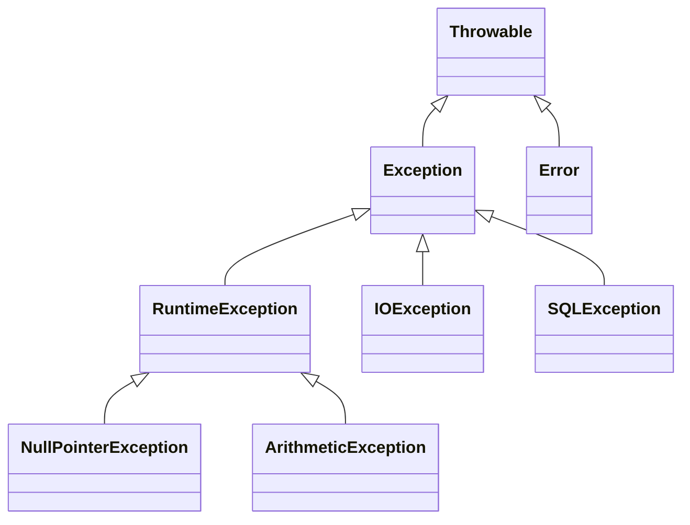

# Exceptions in Java

## Introduction
Exceptions in Java are unexpected events that occur during the execution of a program, disrupting its normal flow. 
They are objects that represent errors or unusual conditions. Exception handling provides a way to handle such situations gracefully without crashing the program.

---

## Key Points
- All exceptions in Java are part of the **Throwable** class hierarchy.
- The two main categories are:
  1. **Checked Exceptions** – Must be handled at compile time.
  2. **Unchecked Exceptions (Runtime Exceptions)** – Occur at runtime, not checked at compile time.
- Errors are also part of `Throwable` but represent serious problems that applications should not attempt to handle.

---

## Exception Hierarchy

```plaintext
                Throwable
                /      \
        Exception        Error
          /    \
 Checked      RuntimeException
 Exceptions   (Unchecked)
```

### Diagram Representation


---

## Types of Exceptions

### 1. Checked Exceptions
- Checked at **compile-time**.
- Must be either handled using `try-catch` or declared using `throws`.
- Examples: `IOException`, `SQLException`.

### Example:
```java
import java.io.*;

class CheckedExample {
    public static void main(String[] args) {
        try {
            FileReader file = new FileReader("test.txt");
        } catch (IOException e) {
            System.out.println("File not found: " + e.getMessage());
        }
    }
}
```

### 2. Unchecked Exceptions
- Occur at **runtime**.
- Not checked at compile time.
- Examples: `ArithmeticException`, `NullPointerException`, `ArrayIndexOutOfBoundsException`.

### Example:
```java
class UncheckedExample {
    public static void main(String[] args) {
        int a = 10 / 0; // ArithmeticException
    }
}
```

### 3. Errors
- Serious issues that cannot be handled by applications.
- Examples: `OutOfMemoryError`, `StackOverflowError`.

---

## Exception Handling Mechanism

Exception handling in Java is managed using **5 keywords**:

1. `try` – Block of code where exception may occur.
2. `catch` – Block of code that handles the exception.
3. `finally` – Always executes, regardless of exception occurrence.
4. `throw` – Used to explicitly throw an exception.
5. `throws` – Declares exceptions in method signature.

### Example:
```java
class ExceptionHandlingExample {
    public static void main(String[] args) {
        try {
            int arr[] = new int[5];
            arr[7] = 10; // Exception
        } catch (ArrayIndexOutOfBoundsException e) {
            System.out.println("Error: " + e);
        } finally {
            System.out.println("Finally block executed");
        }
    }
}
```

---

## Difference between Checked and Unchecked Exceptions

| Feature                  | Checked Exceptions            | Unchecked Exceptions |
|---------------------------|--------------------------------|----------------------|
| **Checked at**           | Compile-time                  | Runtime              |
| **Handling Required**    | Yes (must use try-catch/throws)| No (optional)        |
| **Examples**             | IOException, SQLException     | NullPointerException, ArithmeticException |

---

## Custom Exceptions

You can create your own exceptions by extending the `Exception` class.

### Example:
```java
class AgeException extends Exception {
    AgeException(String msg) {
        super(msg);
    }
}

class CustomExceptionDemo {
    static void validateAge(int age) throws AgeException {
        if (age < 18)
            throw new AgeException("Age must be 18 or above");
    }

    public static void main(String[] args) {
        try {
            validateAge(15);
        } catch (AgeException e) {
            System.out.println("Caught Exception: " + e.getMessage());
        }
    }
}
```

---

## Advantages of Exception Handling
- Separates error-handling code from regular code.
- Provides a mechanism to handle runtime errors.
- Helps maintain normal application flow.
- Increases code readability and robustness.

---

## Conclusion
Exception handling in Java is essential for building reliable applications. 
By using the **Throwable hierarchy**, Java provides a structured and organized approach to manage errors and exceptions, ensuring programs continue execution smoothly after encountering unexpected events.
