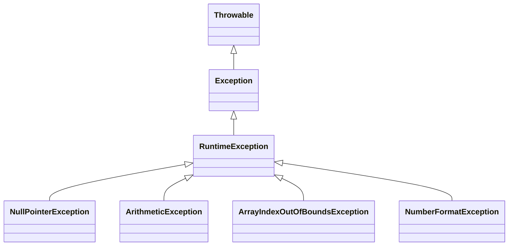

# Unchecked (Runtime) Exceptions in Java

## Introduction
**Unchecked Exceptions**, also known as **Runtime Exceptions**, are exceptions that occur **during program execution (runtime)**. 
Unlike **checked exceptions**, the compiler does not force the programmer to handle them. 
They are usually caused by **programming mistakes** such as logic errors, invalid data handling, or misuse of APIs.

Unchecked exceptions are subclasses of the `RuntimeException` class.

---

## Key Points
- Not checked at compile time → handled at **runtime**.
- Do not require mandatory handling with `try-catch` or `throws`.
- Usually caused by **logical/programming errors**.
- All are subclasses of `RuntimeException`.

---

## Examples of Unchecked Exceptions
- `ArithmeticException`
- `NullPointerException`
- `ArrayIndexOutOfBoundsException`
- `ClassCastException`
- `NumberFormatException`

---

## Exception Hierarchy Focus (Unchecked Exceptions)

```plaintext
                Throwable
                   |
               Exception
                   |
          RuntimeException
             /    |    \
 NullPointer  Arithmetic  ArrayIndexOutOfBounds
```

### Diagram Representation


---

## Example 1: ArithmeticException

```java
class ArithmeticDemo {
    public static void main(String[] args) {
        int a = 10;
        int b = 0;
        int result = a / b; // Division by zero → ArithmeticException
        System.out.println("Result: " + result);
    }
}
```

---

## Example 2: NullPointerException

```java
class NullPointerDemo {
    public static void main(String[] args) {
        String name = null;
        System.out.println(name.length()); // NullPointerException
    }
}
```

---

## Example 3: ArrayIndexOutOfBoundsException

```java
class ArrayDemo {
    public static void main(String[] args) {
        int arr[] = {1, 2, 3};
        System.out.println(arr[5]); // Accessing index 5 → ArrayIndexOutOfBoundsException
    }
}
```

---

## Handling Unchecked Exceptions (Optional)
Even though handling is not mandatory, we can still use **try-catch** for safer programs.

```java
class HandleRuntime {
    public static void main(String[] args) {
        try {
            int arr[] = {10, 20, 30};
            System.out.println(arr[5]);
        } catch (ArrayIndexOutOfBoundsException e) {
            System.out.println("Handled: " + e.getMessage());
        }
    }
}
```

---

## Difference between Checked and Unchecked Exceptions

| Feature                  | Checked Exceptions                      | Unchecked Exceptions |
|---------------------------|-----------------------------------------|----------------------|
| **Checked at**           | Compile-time                            | Runtime              |
| **Handling Required**    | Yes, must handle                        | No, optional         |
| **Caused by**            | External factors (I/O, DB, Network)     | Programmer errors, logic flaws |
| **Examples**             | IOException, SQLException               | NullPointerException, ArithmeticException |

---

## Advantages of Runtime Exceptions
- Do not clutter code with unnecessary `try-catch` blocks.
- Give developers flexibility to handle them when needed.
- Help identify and fix **programming mistakes**.

---

## Conclusion
Unchecked (Runtime) exceptions in Java represent programming errors that occur during execution. 
Although they do not require mandatory handling, developers can use `try-catch` blocks to build more robust applications. 
Understanding and preventing these exceptions improves code quality and reduces runtime failures.
