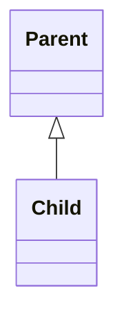
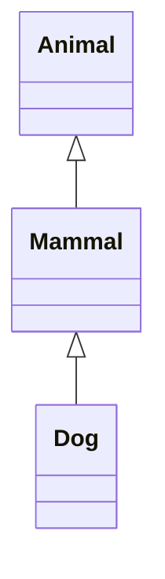
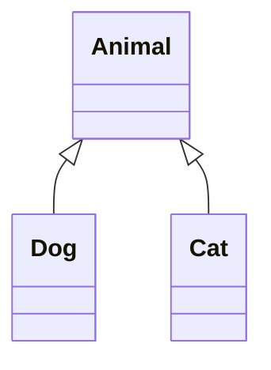
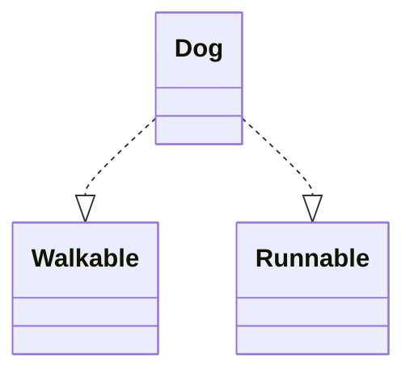

# 🌟 Inheritance in Java

Inheritance is one of the **four core principles of Object-Oriented Programming (OOP)** in Java.  
It allows one class (child/subclass) to **acquire the properties and behaviors** of another class (parent/superclass).

---

## 📌 Why Inheritance?
- ✅ Promotes **code reusability**
- ✅ Improves **readability & maintainability**
- ✅ Supports **method overriding** (runtime polymorphism)
- ✅ Provides a **hierarchical class structure**

---

## 🔑 Syntax

```java
class Parent {
    void display() {
        System.out.println("Hello from Parent!");
    }
}

class Child extends Parent {
    void show() {
        System.out.println("Hello from Child!");
    }
}

public class Main {
    public static void main(String[] args) {
        Child c = new Child();
        c.display(); // Inherited method
        c.show();    // Child method
    }
}
```

---

## 🏷️ Types of Inheritance in Java

Java supports the following types of inheritance (via **classes** and **interfaces**):

### 1️⃣ Single Inheritance
➡️ One class inherits from another.  



```java
class Animal {
    void eat() { System.out.println("Eating..."); }
}

class Dog extends Animal {
    void bark() { System.out.println("Barking..."); }
}
```

---

### 2️⃣ Multilevel Inheritance
➡️ A chain of inheritance.  



```java
class Animal {
    void eat() { System.out.println("Eating..."); }
}

class Mammal extends Animal {
    void walk() { System.out.println("Walking..."); }
}

class Dog extends Mammal {
    void bark() { System.out.println("Barking..."); }
}
```

---

### 3️⃣ Hierarchical Inheritance
➡️ Multiple subclasses inherit from a single parent.  



```java
class Animal {
    void eat() { System.out.println("Eating..."); }
}

class Dog extends Animal {
    void bark() { System.out.println("Barking..."); }
}

class Cat extends Animal {
    void meow() { System.out.println("Meowing..."); }
}
```

---

### 4️⃣ Multiple Inheritance (Through Interfaces)
➡️ Java does **not** support multiple inheritance with classes (to avoid ambiguity).  
➡️ But it **supports multiple inheritance via interfaces**.  



```java
interface Walkable {
    void walk();
}

interface Runnable {
    void run();
}

class Dog implements Walkable, Runnable {
    public void walk() { System.out.println("Walking..."); }
    public void run()  { System.out.println("Running..."); }
}
```

---

## 🚫 Note on Hybrid Inheritance
Java does **not support hybrid inheritance** (combination of multiple types) with classes due to the **diamond problem**.  
It is, however, achievable through interfaces.

---

## 🎯 Summary
- **Single** → One parent → one child  
- **Multilevel** → Chain of inheritance  
- **Hierarchical** → One parent → many children  
- **Multiple** → Achieved using interfaces  

---

## 📚 References
- [Java Official Docs - Inheritance](https://docs.oracle.com/javase/tutorial/java/IandI/subclasses.html)
- [Oracle Java Tutorials](https://docs.oracle.com/javase/tutorial/)

---
✨ *Inheritance makes Java powerful, reusable, and organized!*
